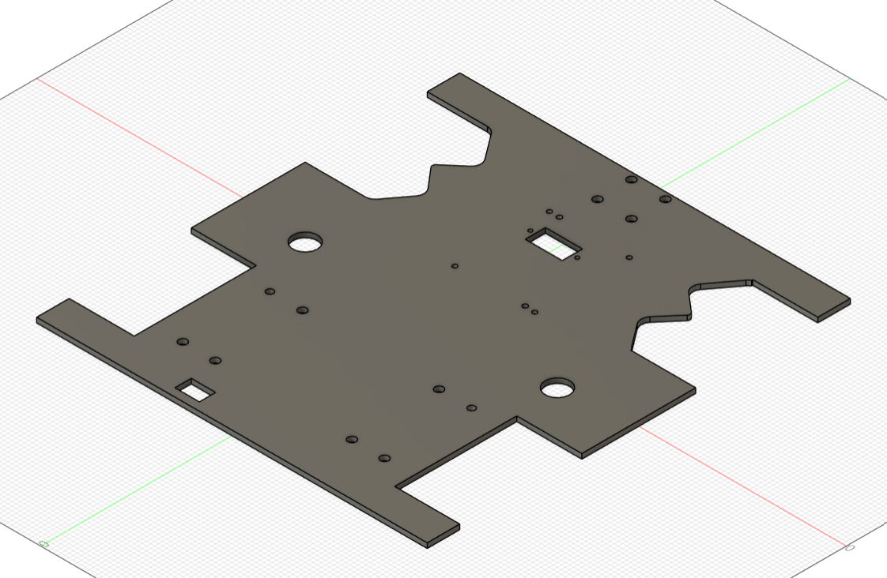
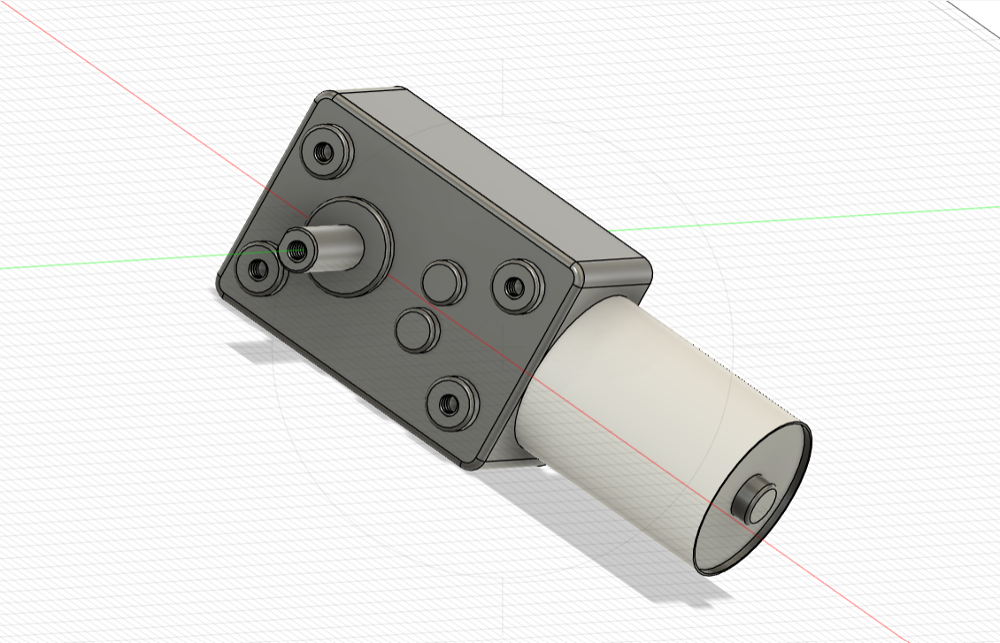

# Tracción

El sistema de tracción del robot fue diseñado utilizando **Autodesk Fusion 360**, con el objetivo de desarrollar un mecanismo de locomoción estable, eficiente y de fácil fabricación para un robot móvil terrestre de pequeña escala orientado a aplicaciones logísticas o de navegación autónoma en entornos interiores como bodegas.

El robot emplea un sistema de **locomoción diferencial**, basado en dos ruedas motrices accionadas de manera independiente por motores con caja reductora. Este tipo de configuración es ampliamente utilizado en robótica móvil debido a su simplicidad mecánica, facilidad de control y buena maniobrabilidad en espacios reducidos.

Para el desplazamiento se seleccionaron **dos motores con caja reductora JGY370**, los cuales proporcionan un equilibrio adecuado entre **velocidad y torque**, permitiendo que el robot pueda desplazarse de manera estable sobre superficies planas y transportar su propia estructura junto con los componentes electrónicos.

Durante el proceso de diseño se modelaron diferentes componentes mecánicos en **Fusion 360**, con el fin de verificar dimensiones, interferencias y correcta integración entre las piezas. Posteriormente, dichos componentes fueron **fabricados mediante tecnologías de fabricación digital**, principalmente **corte láser e impresión 3D**, dependiendo de los requerimientos estructurales de cada pieza.

El conjunto de todos estos elementos conforma el **sistema de tracción del robot**, el cual se integra sobre la base estructural principal del vehículo.

---

## Base_Traccion

[Link al diseño en Fusion 360](https://a360.co/4dkDRIV)

La **base de tracción** constituye la estructura principal del sistema de locomoción del robot. Sobre esta pieza se montan los motores, soportes estructurales y demás componentes asociados al movimiento.

Durante el diseño de esta pieza se consideraron aspectos como:

- Distribución del peso del robot.
- Distribución de la carga que soportará el robot.
- Ubicación estratégica de los motores.
- Espacio disponible para componentes electrónicos.
- Rigidez estructural necesaria para soportar vibraciones.

El diseño busca garantizar estabilidad mecánica durante el desplazamiento y facilitar el ensamblaje del sistema completo.

La base fue **fabricada mediante corte láser** en madera 4 mm, técnica que facilita la rápida reproducción de la pieza en caso de ser necesario.

---

## GearBox JGY370

[Link al diseño en Fusion 360](https://a360.co/4luaPZA)

El **motorreductor JGY370** es el encargado de generar el movimiento del robot. Este tipo de motor integra una **caja reductora (gearbox)** que reduce la velocidad de rotación del motor eléctrico mientras incrementa el torque disponible en el eje de salida.

Esta característica resulta especialmente útil en robots móviles, ya que permite:

- Superar la inercia inicial del sistema.
- Mover la estructura del robot con mayor eficiencia.
- Garantizar desplazamientos controlados a baja velocidad y mayor torque.

El motor utilizado corresponde a un **componente comercial**, por lo que no fue diseñado dentro del proyecto. Sin embargo, se incluyó su modelo dentro del entorno CAD con el propósito de **verificar su correcta integración mecánica con el resto del sistema de tracción**.

Esto permitió validar aspectos como alineación, espacio disponible y compatibilidad con los soportes diseñados.

---

## Acople de la llanta al GearBox JGY370

[Link al diseño en Fusion 360](https://a360.co/3NlTGo7)

El **acople de la llanta al GearBox JGY370** es la pieza encargada de conectar el eje del motor con la rueda común del sistema de tracción.

Su función principal es **transmitir el movimiento rotacional del motor hacia la rueda de forma eficiente**, evitando pérdidas de torque, desalineaciones o deslizamientos durante el funcionamiento.

El diseño del acople fue realizado considerando:

- El diámetro del eje del motor.
- El sistema de fijación de la rueda.
- La necesidad de mantener una alineación adecuada entre ambos elementos.

Este componente fue **fabricado mediante impresión 3D utilizando filamento PLA**, lo que permitió adaptar con precisión las dimensiones del acople a las características del motor utilizado.

Además, la impresión 3D facilita la fabricación rápida de prototipos y permite realizar ajustes de diseño en caso de ser necesario.

---

## Soporte de motor derecho e izquierdo

[Link al diseño en Fusion 360 del soporte derecho](https://a360.co/4uqkBQr)
[Link al diseño en Fusion 360 del soporte izquierdo](https://a360.co/4lodmnX)

El **soporte de motor derecho e izquierdo** tienen como función fijar cada uno de los motores reductores al chasis del robot, manteniendo su posición y alineación respecto a la rueda correspondiente.

Estos soportes fueron diseñados teniendo en cuenta varios criterios:

- Garantizar la correcta alineación entre el eje del motor y la rueda.
- Proporcionar una fijación rígida que reduzca vibraciones durante el movimiento.
- Permitir un montaje y desmontaje sencillo del motor en caso de mantenimiento.

La pieza fue **fabricada mediante impresión 3D en filamento PLA**, lo que permitió desarrollar una geometría adaptada específicamente al motor y al espacio disponible dentro del robot.

---

## Rueda común (Wheel)

[Link al diseño en Fusion 360](https://a360.co/47i5jn9)

La **rueda del sistema de tracción** es el elemento encargado de transformar el movimiento rotacional generado por el motor en **desplazamiento lineal del robot sobre la superficie**.

Este componente corresponde a una **rueda comercial**, por lo que no fue diseñada ni fabricada dentro del proyecto.

No obstante, dentro del modelo CAD se incluyó una **representación escalada de la rueda**, con el objetivo de:

- Verificar dimensiones.
- Detectar posibles interferencias con otras piezas.
- Validar la correcta integración con el sistema de tracción.

Esta práctica es común dentro del diseño mecánico asistido por computador, ya que permite evaluar el comportamiento del sistema antes de su fabricación física.

---

## Soporte LiPo

[Link al diseño en Fusion 360](https://a360.co/4uqY3Pr)

El **soporte para la batería LiPo** fue diseñado con el objetivo de alojar de forma segura la batería encargada de alimentar el sistema eléctrico del robot.

La correcta ubicación de la batería es un aspecto importante dentro del diseño del robot, ya que influye directamente en la **distribución del peso y en la estabilidad del sistema durante el desplazamiento**. Esta ubicación fue definida para que la bateria lipo se aloje entre los soporte de los motores.

El diseño del soporte busca cumplir las siguientes funciones:

- Mantener la batería fija durante el movimiento del robot.
- Evitar desplazamientos o vibraciones que puedan afectar los componentes electrónicos.
- Permitir un acceso sencillo para tareas de mantenimiento o reemplazo.

Este soporte será **fabricado mediante corte de madera 4 mm**.

---

## Ensamblaje del sistema de tracción

[Ensamblaje del sistema de tracción](https://a360.co/3P7TtFJ)

El sistema completo de tracción se obtiene mediante el **ensamblaje de todos los componentes descritos anteriormente**.

En primer lugar, los motores JGY370 se fijan a la base estructural utilizando los soportes impresos en 3D. Posteriormente, los acoples diseñados permiten conectar el eje de cada motor con su respectiva rueda, garantizando una transmisión eficiente del movimiento.

Este sistema permite implementar un esquema de **locomoción diferencial**, en el cual cada motor puede ser controlado de manera independiente. Gracias a este principio de funcionamiento, el robot puede realizar diferentes tipos de movimiento, tales como:

- Avance en línea recta.
- Retroceso.
- Giros sobre su propio eje.
- Curvas con diferentes radios de giro.

El diseño modular del sistema de tracción facilita tanto el **proceso de fabricación como el mantenimiento del robot**, ya que cada componente puede ser reemplazado o modificado sin afectar el resto de la estructura.

Esto permite realizar mejoras futuras en el sistema de locomoción sin necesidad de rediseñar completamente el robot.